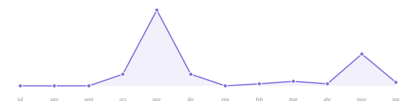

## About me

🎓 Systems Engineering student at **Francisco José de Caldas University**
🌍 Based in Colombia | ☁️ Backend Developer, Cloud & DevOps enthusiast
📝 Currently working on [Deployable project for a school business fair](https://github.com/Brayan-22/feriaEmpresarial-ColegioAteniense)
🧐 Learning **AWS**, **CI/CD pipelines**, and **Python + scikit-learn**
🎯 Goal: become a Full Stack Developer, Cloud & DevOps

---

## 🛠️ Tech stack

**Backend**

**Frontend**

**Databases**

**DevOps & Cloud**

---

## 📊 GitHub stats

  
  

  

  <a href="https://github.com/Brayan-22">View GitHub profile</a> •
  <a href="https://github.com/Brayan-22?tab=repositories">Repositories</a> •
  <a href="https://github.com/Brayan-22">Activity & Top languages</a>

---

## 📈 Commit activity

---

